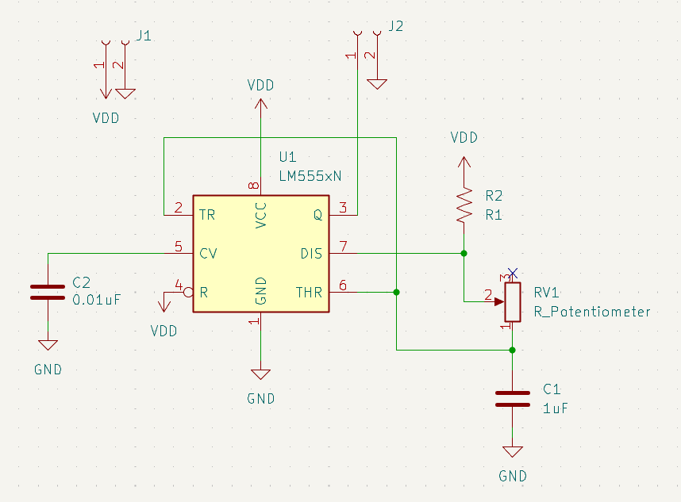
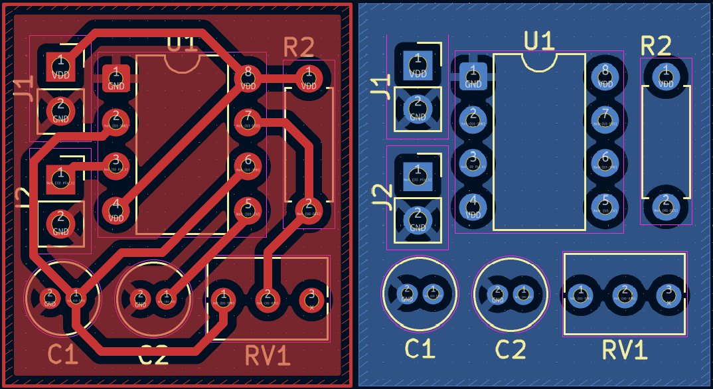
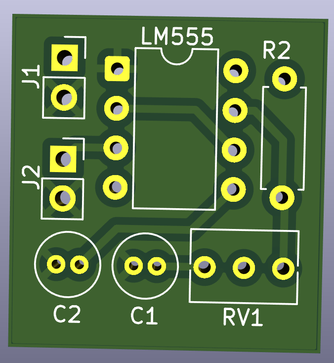
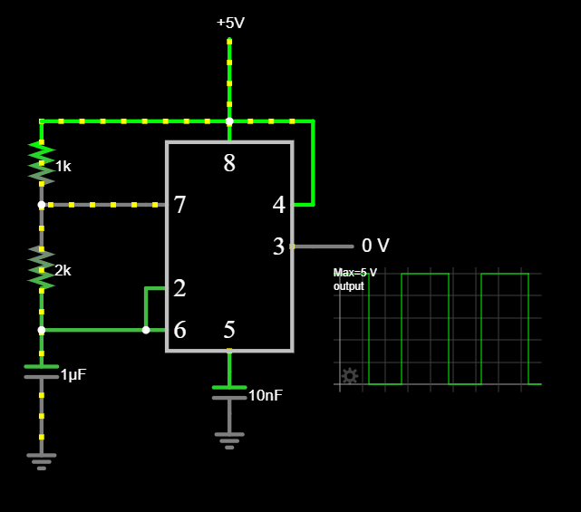

<h2>Circuits using 555 IC</h2>

## Astable Circuit
   
*    An astable 555 circuit continuously charges and discharges a capacitor through two resistors, never settling into a stable state. This repeating charge and discharge cycle forces the output to oscillate indefinitely, creating a square wave.
*    The rate of discharge is controlled by the RC delay. By using a potentiometer or a trimmer, we can adjust the R and therefore adjust the frequency of the Square wave. 

Schematic

   
  
   

Layout

   
   
   

3D model

   
   

Falstad Simulation

*   Link to Falstad [file.](https://github.com/Ryan-Perera/PCBs/blob/main/555/resources/555_Astable.txt)
   
  
   

[astable_schematic]: images/555_Astable_c.png
[astable_layout]: images/555_Astable_a.png
[astable_3dmodel]: images/555_Astable_b.png
[astable_falstad]: images/555_Astable_d.png
